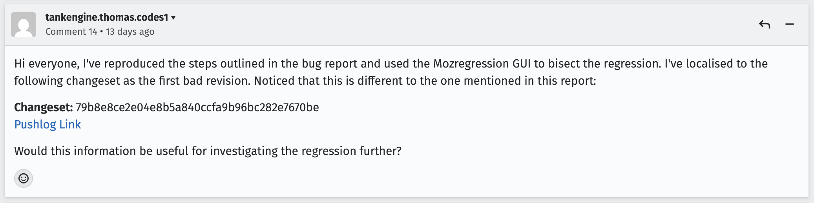

# Bug 2067366 - Firefox

## 1. Bug
[Bug Link](https://bugzilla.mozilla.org/show_bug.cgi?id=2067366)
Title: Drop-down menus in the font settings dialog don't have scrollbars 

## 2. Mozregression
Regression range:
| Verdict | Build |
|---|---|
| GOOD | 2025-08-28 |
| BAD | 2026-08-28 | 

## 3. Identified BIC
Changeset: 79b8e8ce2e04e8b5a840ccfa9b96bc282e7670be
[Pushlog link](https://hg-edge.mozilla.org/integration/autoland/pushloghtml?fromchange=aeb0794ad654a5601d3739cb721bf151578d570d&tochange=79b8e8ce2e04e8b5a840ccfa9b96bc282e7670be)

### My comment:
