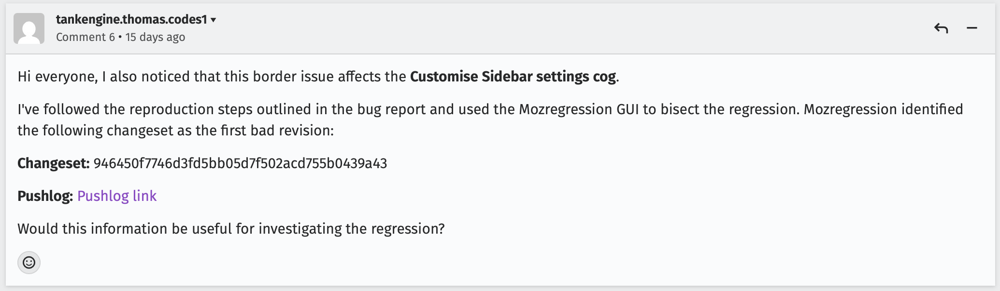

# Bug 2067372 - Firefox

## 1. Bug
[Bug Link](https://bugzilla.mozilla.org/show_bug.cgi?id=2067372)
Title: Websearch refinement is not reflected in the urlbar
Description: The bing search engine not changing when websearch is updated

## 2. Mozregression
Regression range:
| Verdict | Build |
|---|---|
| GOOD | 2024-08-10 |
| BAD | 2026-08-10 | 

## 3. Identified BIC
Changeset: 946450f7746d3fd5bb05d7f502acd755b0439a43
[Pushlog link](https://hg-edge.mozilla.org/integration/autoland/pushloghtml?fromchange=02bd6778ff7ccb32710a32fdf056ad24e576d89a&tochange=946450f7746d3fd5bb05d7f502acd755b0439a43)

### My comment:
