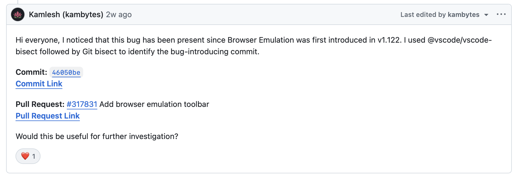

# Issue 332182 - VSCode

By using vscode bisect tool and then git bisect.

## 1. Bug
[Bug Link](https://github.com/microsoft/vscode/issues/332182)
Title: Integrated Browser: Element picker does not highlight during mobile emulation

## 2. Mozregression
Regression range:
| Verdict | Build |
|---|---|
| GOOD | 1.121 |
| BAD | 1.135 | 

npx --yes @vscode/vscode-bisect@latest --good 1.121 --bad 1.135 --quality stable –releasedOnly

git bisect start && git bisect bad 6a49527b96e326fe62fbdb56f60e16877c9aa724 && git bisect good f6cfa2ea2403534de03f069bdf160d06451ed282

## 3. Identified BIC
[Commit Link](https://github.com/microsoft/vscode/commit/46050be407ed64db2763d0c47d028a4f83b31390
) - 46050be407ed64db2763d0c47d028a4f83b31390
[Pull Request link](https://github.com/microsoft/vscode/pull/317831) - 317831

### My comment:
